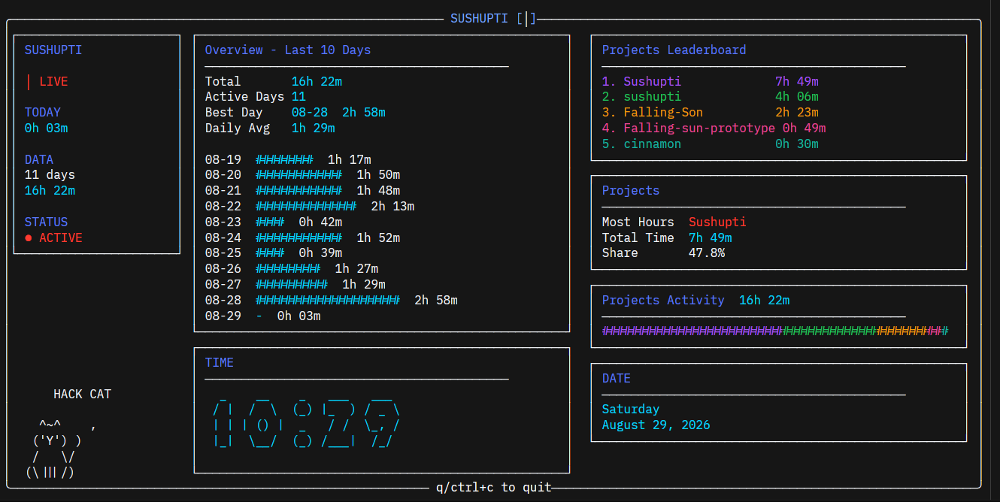

# Sushupti

<p>
    
</p>

A terminal dashboard for your Hackatime coding activity.

Sushupti pulls your coding data from Hackatime and turns it into a small,
live terminal dashboard with project stats, coding time, languages,
and daily activity.

Built with Go, Bubble Tea, Lipgloss, Go-Figure

## What it shows

- Total coding time
- Active days
- Best coding day
- Daily average
- Daily activity graph
- Most-used project
- Project leaderboard
- Project time distribution
- Current date and time
- Live status indicator
- A tiny animated cat because why not

## Requirements

- Hackatime
- A terminal

Sushupti reads your Hackatime configuration from:

```text
~/.wakatime.cfg
